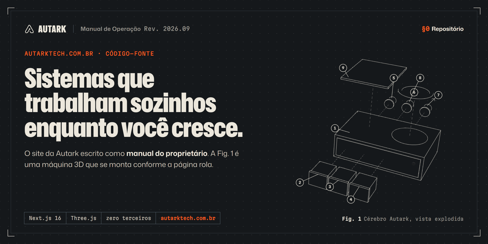
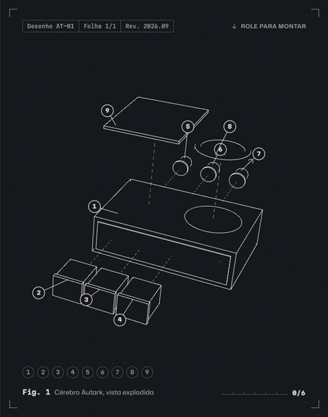
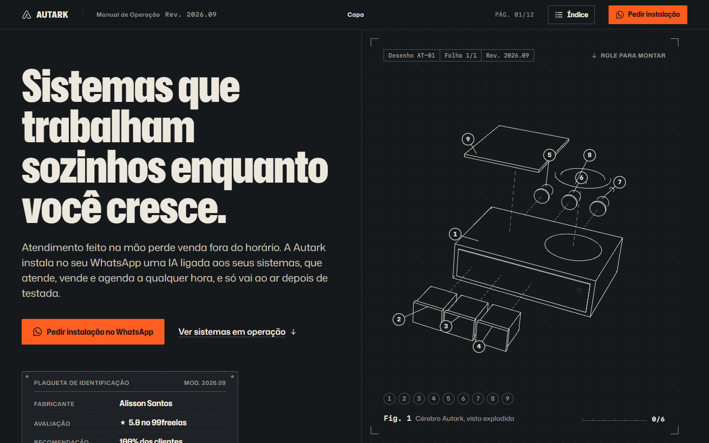
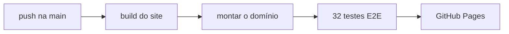

<a href="https://autarktech.com.br/">
  
</a>

<p align="center">
  <a href="https://autarktech.com.br/"></a>
  <a href="https://github.com/ParkNow914/ParkNow914.github.io/actions/workflows/publicar.yml"></a>
  <a href="https://github.com/ParkNow914/ParkNow914.github.io/actions/workflows/quality.yml"></a>
  <a href="https://github.com/ParkNow914/ParkNow914.github.io/actions/workflows/disponibilidade.yml"></a>
  
  
</p>

Este repositório é tudo o que vai ao ar em **[autarktech.com.br](https://autarktech.com.br/)**, o domínio da Autark, estúdio de automação com IA de Alisson Santos.

A home é o **Manual de Operação**. O site inteiro é o manual do proprietário de um sistema que trabalha sozinho, com especificação, montagem, ensaios, termo de garantia e assistência técnica. Quem chega pelo Instagram ou por um anúncio lê o que a Autark faz no formato de um documento técnico, e cada afirmação vem com prova: sistema em produção, demo aberta, avaliação copiada como o cliente escreveu.

<table>
<tr>
<td width="46%" valign="top">
<picture>
  <source srcset=".github/readme/fig1-montagem.webp" type="image/webp" />
  
</picture>
</td>
<td valign="top">

### Fig. 1: a máquina que se monta

A peça central da home é o **Cérebro Autark**, uma máquina 3D de nove peças que começa como desenho técnico em vista explodida e se monta enquanto a página rola.

- Cada passo da §1 encaixa as peças daquele passo, e a figura marca com balões numerados a peça da vez.
- As faces pintam exatamente a cor do papel da página. É isso que faz o 3D parecer desenho em traço até ganhar volume.
- No último passo a lâmpada acende e aparece a etiqueta **OPERANDO**.
- O Three.js só carrega na primeira interação. Até lá, e em aparelho sem WebGL, a moldura mostra um pôster gerado da própria cena.
- Com "reduzir movimento" ligado no sistema, a máquina aparece montada e parada, com um botão para ver a montagem.

A cena é procedural: sem modelo baixado, sem HDRI de CDN, sem nenhuma requisição fora do domínio.

</td>
</tr>
</table>

<table>
<tr>
<td width="72%"></td>
<td width="28%"></td>
</tr>
</table>

## §1 O que mora aqui

```
site/                  a home: Next.js exportado como arquivos estáticos (ver site/README.md)
lp/                    landings de tráfego pago: agenda, atendimento, juridico, delivery
assets/                arquivos das landings (fontes, logo, foto). Também servem a quem
                       mora fora deste repositório: o /lab/ puxa assets/fonts/ e o README
                       do perfil no GitHub mostra os prints de assets/*.webp
tools/
  montar-site.sh       junta site/out, lp/ e assets/ em _site/, o que vai ao ar
  check-assets.py      referências locais das landings e assets órfãos
  fetch-fonts.py       regenera assets/fonts/ (fontes das landings e do /lab/)
lighthouserc*.json     metas de Lighthouse da CI (desktop e mobile)
_headers               cabeçalhos HTTP ideais; o GitHub Pages ignora (ver o próprio arquivo)
CNAME                  registro do domínio; quem manda é Settings > Pages
.github/workflows/     publicação, qualidade e disponibilidade
.github/readme/        imagens deste README
```

Três outros endereços do domínio são repositórios próprios, servidos pelo GitHub Pages em `autarktech.com.br/<repo>/`: [`/lab/`](https://autarktech.com.br/lab/), [`/pdv-lio-demo/`](https://autarktech.com.br/pdv-lio-demo/) e [`/configurador-camadas/`](https://autarktech.com.br/configurador-camadas/). Nada aqui os publica, mas o monitor de disponibilidade vigia os três.

## §2 Como vai ao ar

Push na `main` publica. Nada chega ao domínio sem passar pelos testes no site já montado, com as landings junto.



1. `npm ci && npm run build` em `site/` gera o export estático em `site/out/`.
2. `tools/montar-site.sh` põe o site na raiz e `lp/` e `assets/` ao lado, em `_site/`. Se o site e as pastas antigas disputarem o mesmo caminho, a montagem falha.
3. `site/scripts/e2e.mjs --landings` roda os testes de ponta a ponta no domínio montado.
4. `actions/deploy-pages` publica.

Em pull request o workflow faz os passos 1 a 3 e para. Se um teste falha, nada vai ao ar e o site continua na versão anterior. Para voltar uma versão, reverta o commit na `main`: o workflow publica o estado anterior em poucos minutos.

O Pages está com a fonte **GitHub Actions** (Settings > Pages). O DNS no Registro.br aponta os registros A para o GitHub Pages, e o HTTPS é do próprio GitHub.

## §3 Qualidade

| | Performance | Acessibilidade | Boas práticas | SEO |
|---|:-:|:-:|:-:|:-:|
| Desktop (mediana de 3) | 100 | 100 | 100 | 100 |
| Celular, 4G lenta e CPU 4x (mediana de 5) | 91 | 100 | 100 | 100 |

| Workflow | Quando | O que garante |
|---|---|---|
| Publicar | push, PR | build, 32 testes de ponta a ponta no site montado, publicação |
| Qualidade | push, PR, segunda 09:00 UTC | HTML e CSS das landings, referências locais, links externos, Lighthouse desktop e mobile na home, no 404 e nas landings |
| Disponibilidade | 09:00 e 21:00 UTC | a home responde com "Manual de Operação", as 4 landings e as 3 demos respondem, o certificado não está vencendo. Se algo cair, abre uma issue |

Os testes de ponta a ponta cobrem:
- estrutura e JSON-LD;
- ilhas estáticas funcionando sem hidratação;
- calculadora e ordem de serviço montando a mensagem do WhatsApp;
- índice pelo teclado;
- montagem 3D até OPERANDO;
- origem UTM nos links;
- página sem JavaScript;
- links da home anterior (`#projetos`, `#contato`, `#faq`, `#calculadora`) caindo na seção certa;
- 404;
- 7 larguras de tela sem rolagem horizontal;
- movimento reduzido.

## §4 Rodar localmente

```bash
cd site
npm install
npm run dev                      # http://localhost:3000, só o site
npm run build                    # gera site/out/
cd .. && bash tools/montar-site.sh
node site/scripts/serve.mjs _site 3100      # domínio montado, como no GitHub Pages
node site/scripts/e2e.mjs http://localhost:3100/ --landings
```

## §5 Decisões que valem para o domínio inteiro

- **Nenhum request a terceiros.** Fontes, imagens e 3D saem do próprio domínio; não há analytics nem cookies. A página vende LGPD e precisa ser coerente com isso.
- **CSP via `<meta>`.** O GitHub Pages não deixa configurar cabeçalhos, então cada página leva a política no HTML. `frame-ancestors` fica de fora porque o navegador ignora essa diretiva em `<meta>`.
- **O service worker da home anterior foi desligado.** `/sw.js` agora é um desinstalador: apaga os caches e se desregistra no navegador de quem visitou o site antigo. Não volte a registrar service worker sem pensar em como desligá-lo depois.
- **Links antigos continuam chegando.** As âncoras da home anterior existem no site novo como marcadores invisíveis na seção equivalente (`LEGACY_ANCHORS` em `site/src/content/site.ts`).
- **Sem `aggregateRating` no JSON-LD.** Nota da própria empresa sobre si viola a política de reviews do Google. As avaliações do 99freelas ficam visíveis na página.
- **Dependências vigiadas.** O dependabot abre um PR por mês para o site e outro para as actions, e todo PR passa pelo workflow Publicar antes do merge. O `@types/node` só sobe de major junto com o Node do build.

### Trocar de domínio

O domínio aparece em:
- `SITE_URL` em `site/src/content/site.ts`;
- canonical e Open Graph de cada landing em `lp/*/index.html`;
- `.github/workflows/disponibilidade.yml`;
- a exclusão do lychee em `.github/workflows/quality.yml`;
- `CNAME`.

Depois de trocar esses pontos, configure o domínio novo em Settings > Pages e aponte o DNS.

---

<p align="center"><sub><b>Autark</b> · Manual de Operação · Rev. 2026.09 · por <a href="https://github.com/ParkNow914">Alisson Santos</a> · <a href="https://autarktech.com.br/">autarktech.com.br</a></sub></p>
